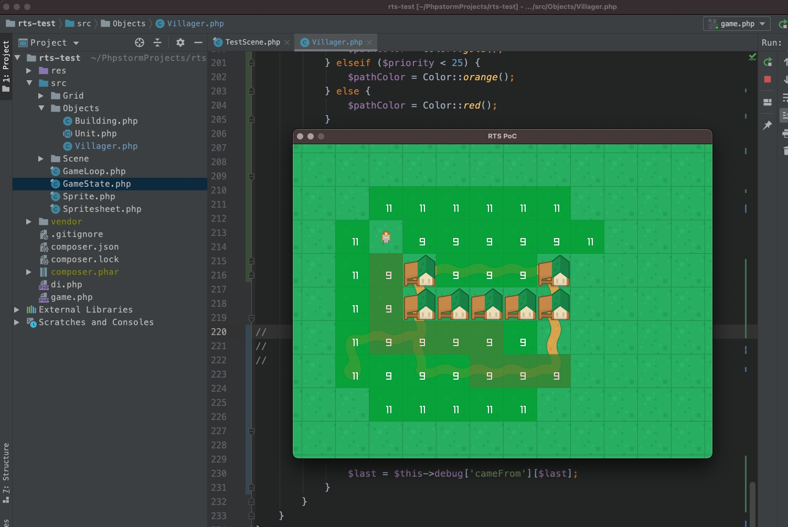

rts-test
---

This project requires PHP `>=8.0.5`  because it contains a very important bugfix to the FFI extension: https://bugs.php.net/bug.php?id=80847.

Make sure you have the `raylib 3.5.0` library installed locally before running the project. See https://www.raylib.com/.

## Screenshot

The above screenshot presents (in debug mode) the weights applied with the A* pathfinding algorithm. The darker squares are the chosen path towards the destination.

## How is it possible?

This project uses an experimental library I'm writting, named [raylib-ffi](https://github.com/nawarian/raylib-ffi).

For more information on how FFI works in PHP, please read https://thephp.website/en/issue/php-ffi/.
